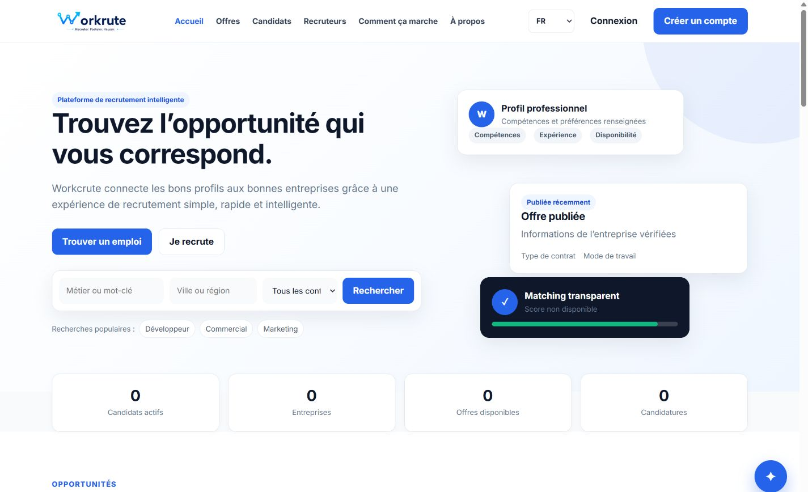
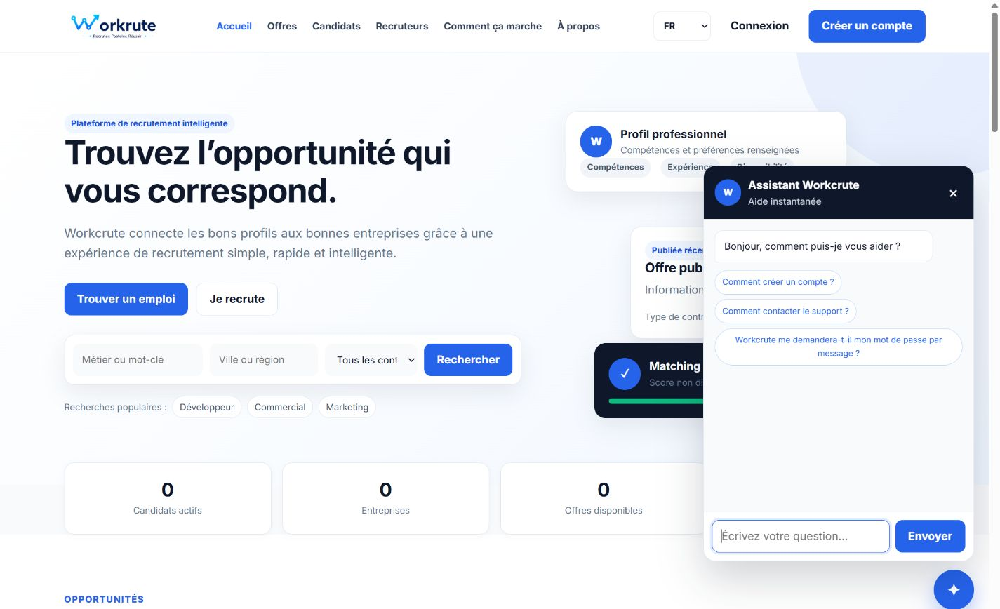

# Guide utilisateur Workcrute

Ce guide s’adresse aux utilisateurs et administrateurs sans connaissances techniques. Les intitulés peuvent varier légèrement selon la langue choisie ou les options activées par l’administrateur.

## 1. Présentation de Workcrute

Workcrute réunit dans une même plateforme :

- les candidats qui créent leur profil, déposent leurs documents et suivent leurs candidatures ;
- les recruteurs qui publient des offres et organisent leur processus de recrutement ;
- l’administration qui supervise les comptes, les contenus, les paramètres et la sécurité.

Les informations affichées proviennent des données réellement enregistrées. Un score de matching n’est montré que lorsqu’un calcul fiable est possible.

## 2. Accès au site

Ouvrez [https://workcrute.pages.dev](https://workcrute.pages.dev) dans un navigateur récent. La page d’accueil donne accès aux offres, aux espaces candidat et recruteur, à la connexion et au centre d’aide.

Si une page ne s’ouvre pas :

1. vérifiez votre connexion Internet ;
2. actualisez la page ;
3. réessayez dans une fenêtre privée ;
4. contactez le support en indiquant la référence affichée avec le message d’erreur.

## 3. Choix de la langue

Utilisez le sélecteur de langue situé dans l’en-tête ou dans la barre supérieure de votre espace :

- `FR` : français ;
- `EN` : anglais ;
- `AR` : arabe.

L’arabe active automatiquement l’affichage de droite à gauche. Le choix est mémorisé sur l’appareil utilisé.

## 4. Créer un compte candidat

1. Cliquez sur **Créer un compte**.
2. Choisissez **Je cherche un emploi**.
3. Renseignez votre identité et vos coordonnées.
4. Choisissez un mot de passe conforme aux règles affichées.
5. Complétez les informations professionnelles et les préférences.
6. Ajoutez un CV si cette pièce est obligatoire ou si vous souhaitez le faire immédiatement.
7. Acceptez les conditions d’utilisation.
8. Cliquez sur **Terminer mon inscription**.

Une erreur de document ne doit pas supprimer les autres informations saisies. Si le compte est créé mais que le document échoue, reconnectez-vous puis ajoutez-le depuis **Documents**.

## 5. Créer un compte recruteur

1. Cliquez sur **Créer un compte**.
2. Choisissez **Je recrute**.
3. Indiquez votre identité et vos coordonnées professionnelles.
4. Présentez l’entreprise : nom, secteur, taille, ville et site Internet si disponible.
5. Précisez vos besoins de recrutement.
6. Validez l’inscription.

Après connexion, complétez la fiche **Entreprise** avant de publier votre première offre.

## 6. Se connecter

1. Ouvrez **Connexion**.
2. Saisissez l’adresse e-mail du compte.
3. Saisissez le mot de passe.
4. Cliquez sur **Se connecter**.

Workcrute ouvre automatiquement l’espace correspondant au rôle du compte. Ne partagez jamais votre mot de passe.

## 7. Mot de passe oublié

1. Sur la page de connexion, cliquez sur **Mot de passe oublié ?**
2. Saisissez votre adresse e-mail.
3. Cliquez sur **Envoyer le lien**.
4. Consultez votre messagerie et suivez les instructions reçues.

Pour des raisons de confidentialité, Workcrute affiche le même message que l’adresse existe ou non.

## 8. Utiliser l’espace candidat

Le tableau de bord candidat présente :

- les candidatures envoyées et en cours ;
- les entretiens à venir ;
- les consultations du profil ;
- la complétude du profil et les éléments manquants ;
- les offres recommandées ;
- les notifications et l’activité récente.

Sur mobile, utilisez la navigation située en bas de l’écran et le bouton de menu pour accéder aux autres rubriques.

## 9. Profil candidat

Ouvrez **Profil**, puis **Modifier le profil**. Complétez autant que possible : identité, résumé, métier, ville, disponibilité, expérience, formation, compétences, langues et préférences professionnelles.

Pour la disponibilité, choisissez **Immédiatement**, **Dans 1 mois**, **Dans 2 mois** ou **Autre**. Si vous choisissez **Autre**, précisez la date ou le délai.

Cliquez sur **Enregistrer les modifications**. En cas d’erreur, corrigez uniquement le champ signalé : les autres données restent dans le formulaire.

## 10. CV

Depuis **Documents** :

1. cliquez sur **Ajouter un document** ;
2. choisissez le type **CV** ;
3. sélectionnez le fichier ;
4. lancez le téléversement ;
5. utilisez **Choisir comme CV principal** si plusieurs CV sont présents.

Le CV principal est celui proposé en priorité dans les parcours de candidature.

## 11. Autres documents

Vous pouvez ajouter plusieurs fichiers : lettre, diplôme, certificat, portfolio ou autre document. Les formats, la taille maximale et le nombre autorisé sont définis par l’administration.

Les actions disponibles sont : ajouter, télécharger, supprimer et définir le CV principal. Avant une suppression, vérifiez que le document n’est plus utile.

## 12. Rechercher des offres

Ouvrez **Offres** puis utilisez le mot-clé, la ville, le secteur et le contrat. Cliquez sur une offre pour consulter sa description, ses missions, ses critères et son éventuel questionnaire.

Le bouton **Enregistrer** ajoute l’offre aux favoris. Une offre expirée, fermée ou suspendue n’est plus disponible à la candidature.

## 13. Candidatures

Depuis le détail d’une offre :

1. vérifiez l’offre et vos documents ;
2. ajoutez un message de motivation si nécessaire ;
3. répondez aux questions obligatoires ;
4. cliquez une seule fois sur **Postuler** ;
5. attendez le message de confirmation.

Retrouvez ensuite la candidature dans **Candidatures**. Les statuts possibles sont : envoyée, vue, présélectionnée, entretien, acceptée, refusée et retirée lorsque le retrait est autorisé.

## 14. Alertes emploi

Dans **Alertes emploi**, cliquez sur **Créer une alerte**. Donnez-lui un nom puis renseignez le métier ou mot-clé, le secteur, la ville, le contrat, les compétences et la fréquence. Une alerte peut être désactivée, réactivée ou supprimée.

## 15. Entretiens candidat

La page **Entretiens** sépare les rendez-vous à venir, passés et annulés. Chaque fiche peut indiquer l’offre, l’entreprise, la date, l’heure, le type, l’adresse ou le lien, et le statut.

Selon le rendez-vous, vous pouvez confirmer, refuser ou demander une modification. Pour une visioconférence, testez le lien avant l’heure prévue.

## 16. Utiliser l’espace recruteur

Le tableau de bord recruteur affiche les offres actives, les nouvelles candidatures, les présélections, les entretiens, les performances des offres et l’activité récente. Les recommandations ne sont affichées que lorsqu’un matching réel est calculable.

## 17. Créer une offre

Ouvrez **Mes offres**, puis **Créer une offre**. Le parcours comprend six étapes :

1. informations générales ;
2. description ;
3. critères ;
4. conditions ;
5. questionnaire ;
6. aperçu et publication.

Utilisez **Enregistrer le brouillon** pour reprendre plus tard. Vérifiez l’aperçu avant de cliquer sur **Publier**. Une offre peut ensuite être modifiée, dupliquée, fermée ou archivée selon son état.

## 18. Questionnaires recruteur

Dans **Questionnaires**, créez un questionnaire ou utilisez un modèle autorisé par l’administration. Les questions peuvent être courtes, longues, numériques, oui/non, à choix, datées, notées ou demander un fichier.

Vous pouvez définir une question obligatoire, un poids, un critère éliminatoire ou une condition. Un critère non satisfait signale la candidature mais ne la supprime jamais automatiquement.

## 19. Gestion des candidats

Les pages **Candidatures** et **Recherche candidats** permettent de consulter l’identité professionnelle, la ville, la disponibilité, les expériences, les compétences, les documents et les réponses autorisées.

Les actions possibles comprennent la présélection, le contact, le téléchargement du CV, la planification d’un entretien, le refus et l’ajout d’une note interne. Une note interne n’est jamais visible par le candidat.

## 20. Pipeline de recrutement

La vue Kanban classe les candidatures en colonnes : nouvelles, consultées, présélectionnées, entretien, acceptées et refusées. Déplacez une carte vers une autre colonne pour changer son statut. Vérifiez que la carte reste dans la nouvelle colonne après l’opération.

La vue liste permet de filtrer et de consulter les mêmes candidatures sous forme de tableau.

## 21. Entretiens recruteur

Dans **Entretiens**, créez un rendez-vous, choisissez le candidat, l’offre, la date, l’heure, la durée et le type : présentiel, téléphone ou visioconférence. Ajoutez une adresse ou un lien adapté. Un entretien peut être modifié, confirmé ou annulé.

## 22. Accéder à l’administration

L’administration se trouve sur `/admin/connexion/`. L’accès se déroule en deux niveaux successifs. Les deux secrets sont fournis séparément par la personne responsable de la sécurité et ne doivent jamais être conservés dans ce guide.

Après plusieurs erreurs, l’accès peut être temporairement bloqué. Attendez la fin du délai ou contactez le responsable autorisé.

## 23. Gestion des candidats par l’admin

Ouvrez **Candidats** pour rechercher et filtrer les comptes. La fiche permet de consulter ou modifier les informations autorisées, suspendre, réactiver, exporter ou supprimer un compte.

La suspension coupe les sessions actives. Avant une suppression, vérifiez les conséquences sur les candidatures et documents liés.

## 24. Gestion des recruteurs

Ouvrez **Recruteurs** pour consulter les coordonnées, l’entreprise, le nombre d’offres, les candidatures reçues et la dernière activité. Les actions de modification, suspension, réactivation, export et suppression sont journalisées.

## 25. Gestion des entreprises

La page **Entreprises** réunit le nom, le secteur, la ville, les recruteurs, les offres et le statut. Utilisez-la pour corriger une fiche, suspendre une entreprise ou la réactiver.

## 26. Gestion des offres

La page **Offres** donne une vue globale. Filtrez par entreprise, statut, date, secteur ou ville. Vous pouvez voir, modifier, suspendre, réactiver, fermer ou supprimer une offre selon le besoin.

## 27. Gestion des candidatures

La page **Candidatures** permet de filtrer par candidat, offre, entreprise, statut ou date. Ouvrez une ligne pour lire le détail et la chronologie. Toute modification sensible est ajoutée au journal d’audit.

## 28. Questionnaires administrateur

Dans **Questionnaires**, l’administrateur peut créer, traduire, modifier, dupliquer, archiver ou supprimer des modèles. Chaque libellé et chaque choix doivent être renseignés en FR, EN et AR.

Pour une condition, choisissez la question source, l’opérateur et la valeur attendue. Réordonnez les questions avec le glisser-déposer ou les commandes de déplacement. Testez toujours le modèle avant de l’autoriser aux recruteurs.

## 29. Chatbot et FAQ

Le chatbot public répond uniquement à partir de la FAQ Workcrute. Si la confiance est insuffisante, il propose des questions proches au lieu d’inventer une réponse.

Dans **Admin > Chatbot**, recherchez, filtrez, ajoutez, traduisez, activez ou désactivez les FAQ. Les questions non comprises peuvent être transformées en nouvelles FAQ. Les statistiques indiquent les thèmes, les langues et le taux de réponse.

## 30. Emails administratifs

Dans **Paramètres > Emails** :

1. renseignez l’adresse principale ;
2. lancez sa vérification ;
3. choisissez les événements à notifier ;
4. choisissez les pièces jointes : aucune, PDF, CSV ou PDF + CSV ;
5. cliquez sur **Envoyer un email de test**.

Un échec d’email n’annule pas la création d’un compte ou d’une candidature. Il est enregistré et peut être retenté.

## 31. Notifications

La cloche de la barre supérieure ouvre les notifications. Elles signalent notamment les événements métier, les actions de sécurité et les erreurs critiques. Marquez les éléments comme lus après vérification.

## 32. Activité en direct

Le **Centre de contrôle Workcrute** affiche l’état du système, les statistiques du jour et un flux d’événements. Les mises à jour arrivent sans recharger toute la page, environ toutes les vingt secondes lorsque le flux direct n’est pas disponible.

Utilisez les filtres Candidats, Recruteurs, Offres, Candidatures, Entretiens, Sécurité et Erreurs pour isoler l’activité utile.

## 33. Centre d’erreurs

Ouvrez **Admin > Erreurs**. Chaque erreur indique la date, la sévérité, le service, le code, la route et un **Request ID**.

Pour traiter une erreur :

1. copiez le Request ID ;
2. ouvrez la ligne ;
3. lisez le service et le message ;
4. ajoutez une note ;
5. passez le statut de **Nouvelle** à **En cours**, puis **Résolue** ;
6. utilisez **Ignorée** uniquement pour un événement identifié comme sans conséquence.

## 34. Paramètres

Les paramètres permettent de gérer sans modifier le code : identité du site, inscriptions, documents, offres, candidatures, entretiens, matching, chatbot, emails et maintenance.

Vérifiez les valeurs avant d’enregistrer. Les poids du matching doivent totaliser 100. Toute modification est journalisée.

## 35. Maintenance

Dans **Paramètres > Maintenance** :

1. préparez les messages FR, EN et AR ;
2. activez la maintenance ;
3. vérifiez le message public ;
4. réalisez l’intervention ;
5. désactivez la maintenance dès la fin.

L’administration reste accessible pendant la maintenance.

## 36. Sécurité

- Utilisez des secrets administrateur longs et différents.
- Ne transmettez jamais un secret, un mot de passe ou un code par capture d’écran.
- Déconnectez-vous après utilisation d’un ordinateur partagé.
- Vérifiez les alertes de connexion suspecte.
- Pour changer un secret ou l’email principal, suivez la confirmation envoyée par e-mail.
- Les notes internes et journaux administratifs ne doivent pas être copiés vers les candidats.

## 37. Problèmes fréquents

### Une page reste en chargement

Actualisez une fois. Si le problème persiste, vérifiez Internet puis notez la référence d’erreur.

### La session a expiré

Cliquez sur **Se reconnecter**, puis reprenez l’action. Les informations non envoyées dans un formulaire doivent rester visibles tant que la page n’est pas fermée.

### Un fichier est refusé

Vérifiez le format, la taille maximale, le nombre de documents et le type choisi. Distinguez un refus de format d’un problème réseau ou de stockage.

### Un email n’arrive pas

Vérifiez les courriers indésirables, l’adresse configurée et l’état de la file dans les paramètres email. Utilisez l’envoi de test.

### Une offre ou candidature est introuvable

Vérifiez les filtres, le statut, l’entreprise et la date. Une offre fermée ou suspendue n’est plus visible comme une offre active.

### Le chatbot ne répond pas précisément

Choisissez une suggestion proche ou ouvrez le centre d’aide. L’administrateur peut convertir la question non comprise en FAQ.

### L’accès admin est bloqué

Le blocage protège contre les tentatives répétées. Attendez le délai prévu et n’essayez pas en boucle.

### Que transmettre au support ?

Indiquez la page, l’heure, l’action effectuée et le **Request ID**. Ne transmettez jamais de mot de passe, secret, code de validation, cookie ou token.
